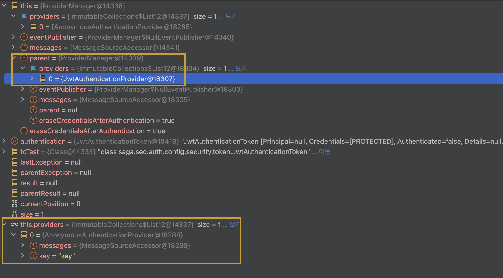
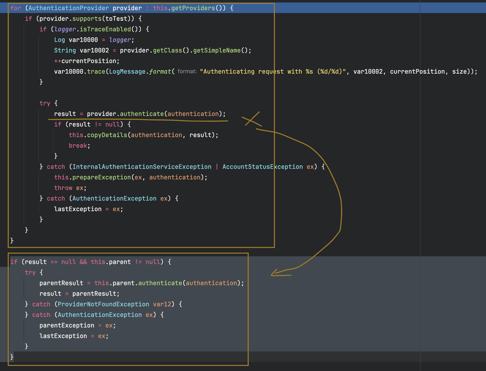

## Spring Security 학습

> Spring Security의 인증(Authentication), 인가(Authorization) 흐름 이해
> 계속해서 시큐리티 컴포넌트 학습용

## 기술 스택

- **Spring Security 6.x**


## ProviderManager, Providers 구성
- ### filter 빈 구성 시에 JwtAuthenticationProvider 설정

```
        @Bean
	public JwtAuthenticationFilter jwtAuthenticationFilter(JwtTokenProvider jwtTokenProvider,
		JwtUserDetailsService userDetailsService) {
		List<AuthenticationProvider> list1 = List.of(
			new JwtAuthenticationProvider(jwtTokenProvider, userDetailsService));
		ProviderManager parent = new ProviderManager(list1);

		List<AuthenticationProvider> list2 = List.of(new AnonymousAuthenticationProvider("key"));
		ProviderManager providerManager1 = new ProviderManager(list2, parent);
		return new JwtAuthenticationFilter(jwtTokenProvider, providerManager1);
	}
```

위의 구성에서는 두 개의 AuthenticationProvider 세트를 정의하고, 하나의 ProviderManager를 부모로 지정하는 방식으로 계층 구조를 구성한다.
parent: JwtAuthenticationProvider
child: AnonymousAuthenticationProvider
실제 디버깅 시에는 다음과 같이 2개의 ProviderManager가 연결되어 있는 구조를 확인할 수 있다.




ProviderManager의 핵심 로직은 다음과 같다. supports() 조건을 만족하는 AuthenticationProvider를 순차적으로 호출하며, 인증이 성공하면 루프를 종료한다. 
만약 모든 provider에서 인증에 실패하면, 부모 ProviderManager로 위임한다.



